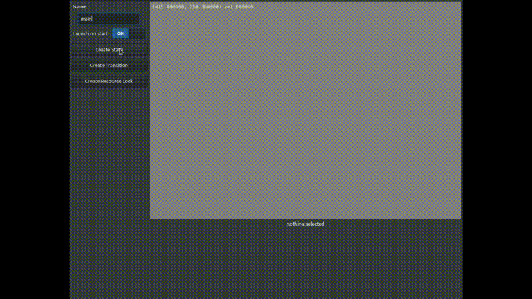
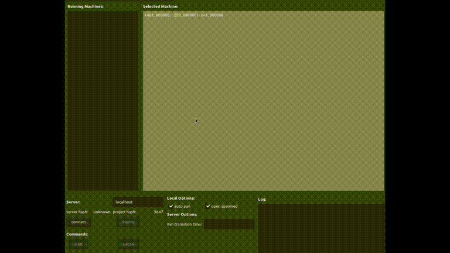

# SMedit

State machine builder and runner. 

**Creating a demo:**


The builder is a linux native program built with GTK and openGL which lets you visually lay out your state machine and type python code into each state. 

**Running the demo:**


The runner is built on the event loop provided by the Twisted web framework. The builder program is also used to control the runner and view the state of execution.

**SECURITY WARNING:** as it stands, the runner is designed to execute python code received over the network. THERE IS NO AUTHENTICATION YET. It will be added when I'm finished implementing all the major planned features.

Note: SMedit is just a placeholder name and I will probably rename it once I can come up with a better name.  

## Getting Started

How to build and run SMedit.

### Building SMedit Builder

Install Prequesites:  TODO  figure out what they are, write them here.

Once the prerequisites are installed, use make to build the runner:

```
make
```

There is no install target for make for now.


### Preparing the Runner

The easiest way to set up the runner is to install the runner's dependencies in a virtualenv. 
To do this, 
```
TODO
```

## Running SMedit

To run the builder:
```
./smedit
```

To launch the runner, run the following:

```
cd server/
source venv/bin/activate   # assumes you have venv set up in the server dir
./main.py
```

## Built With

* TODO - merge the stuff from license.txt here

## Versioning

No versioning to speak of so far. At some point I will declare it 0.0.0.1.

## Author

**Rory Timar**


## Acknowledgments

* This readme is based off PurpleBooth's Readme.md [template](https://gist.github.com/PurpleBooth/109311bb0361f32d87a2#file-readme-template-md)
* TODO - copy other acknowledgements from license.txt to here


